# ZOE FINANCIAL front end developer test

## View 1:
For the starting page, the main logic revolves around the income input, the input:
1) Starts empty and doesn't allows the user to continue disabling the button
2) As you enter the text, the error message appears until the input has five digits.

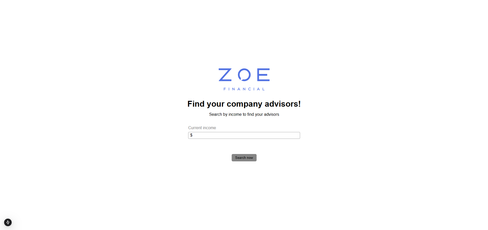
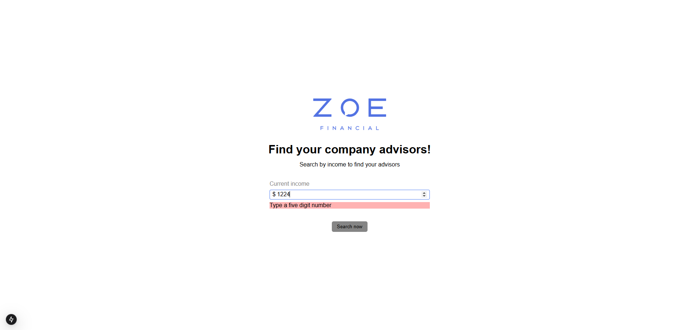
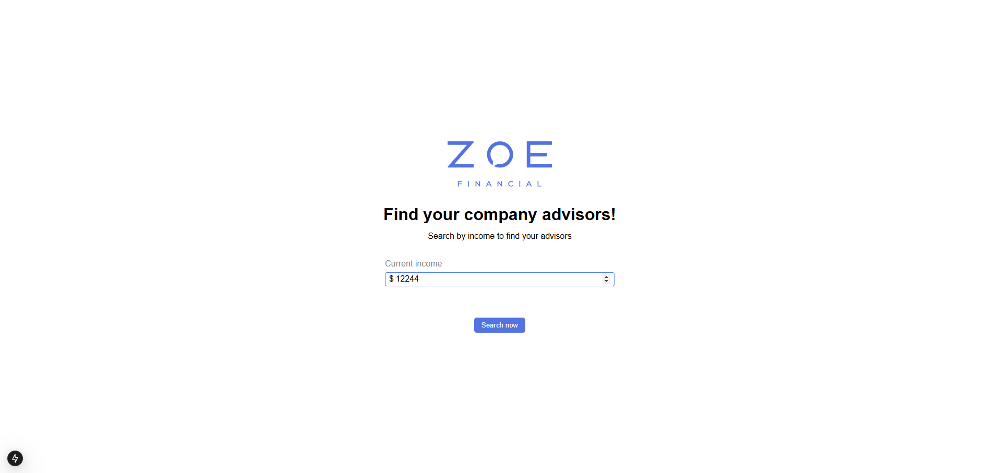

## View 2:
For the list page, it displays a list of advisors filtered by a series of parameters, passed through url:
1) income: indicates the income whereas we are going to look for advisors in the threshold from income 10,000 to income 10,000.
2) sortingParameter: indicates the parameter that is going to determine the sorting of the advisors, the default is "id", but it receives "income" and "name" as well
3) reverseSorting: it indicates if the sorting is crescent or crescent, it is related with sorting parameter
4) page: it indicates the page of the table, where the limit of records is ten

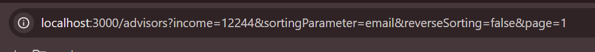
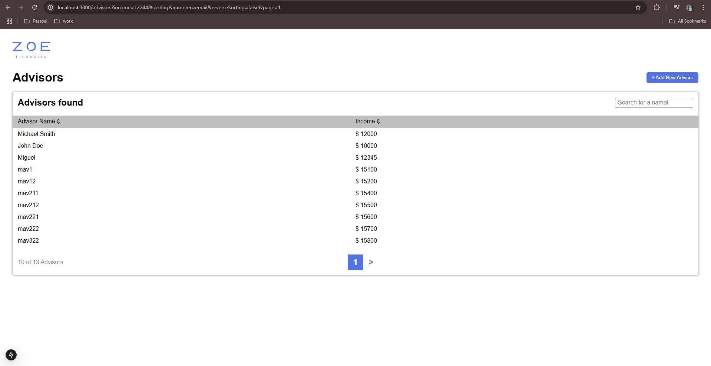

This view got 5 main interactions:
1) The filters by name or income, where you click over them in order to sort by one of them and if you click again it will sort them again in the reverse way. Note that it redirects to a new url with the new parameters (goes to page 1 by default)
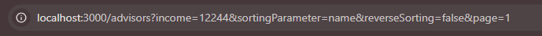
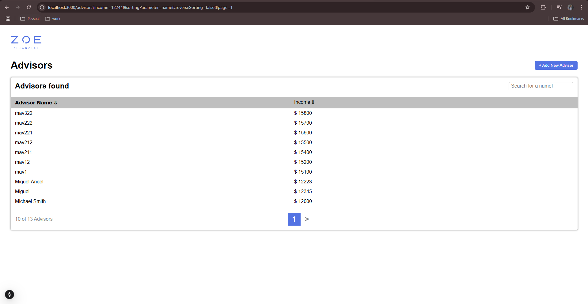
2) The filters by page, where you click over the arrows in the bottom to navigate and see the next or the previous 20 results. Note that it redirects to a new url with the new parameters (keeps reverseSorting and sortingParameter)
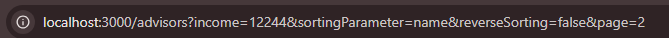
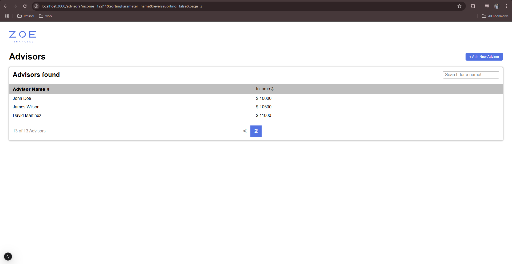
3) New Advisor modal: This modal offers the user the possibility to register a new advisor, first name and income are necessary fields in order to submit the new advisor
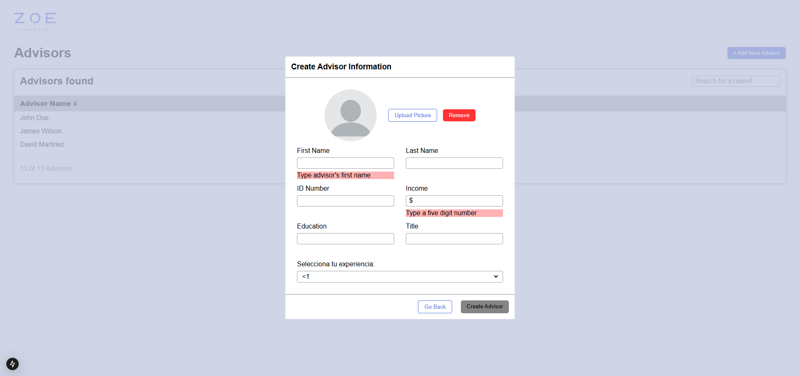
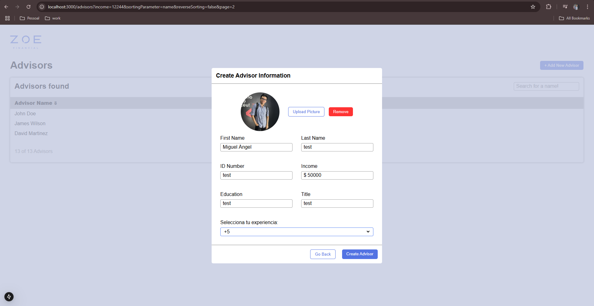
4) When you hover over an advisor, it will show you a notification saying that you can see its details, clicking over it will redirect to that advisor detail view
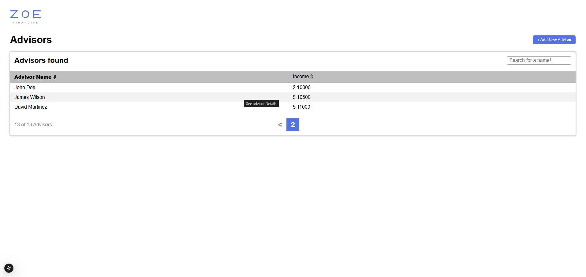
5) *BONUS* Search by name: it is a only relates with the original income query, and brings the advisors whose name starts with the search. It blocks the other filter butons in order to not create confusion, but when the field is empty again it goes back to the original behaviour
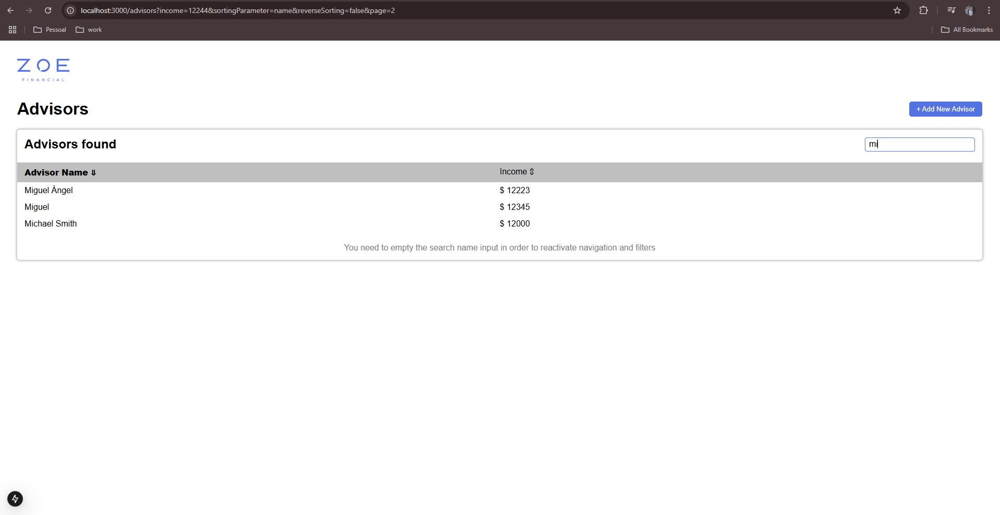

Also there is a fallback message when the income query throws no data
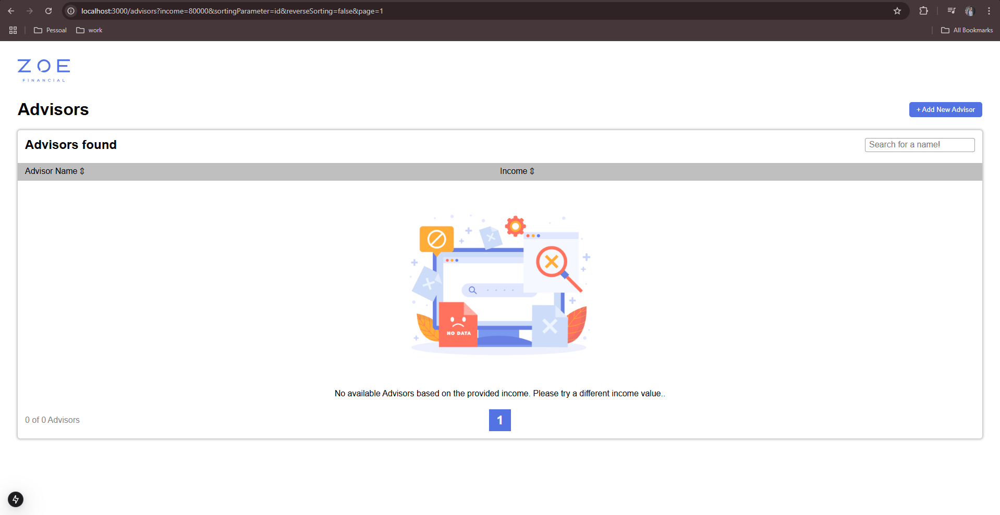

## View 3:
The final view displays a detailed info of an advisor
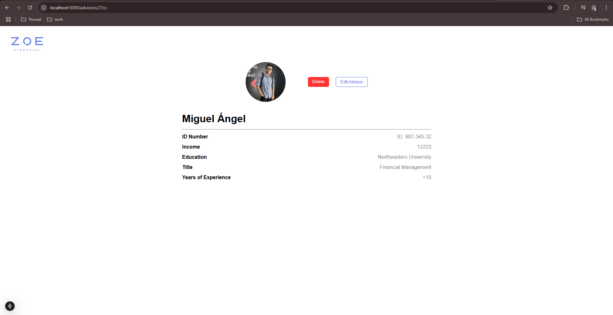

It has 2 buttons with the following functionalities
1) the delete button erases the advisor
2) the edit advisor shows the shared edit/create modal to edit the user information, when done it updates the info and goes back to detail view
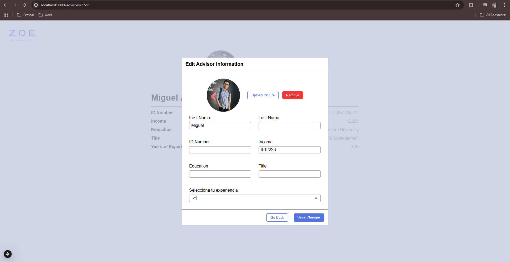

## Responsiveness
The main responsiveness adjustment is done in the edit/create modal, where the layout is a one column for mobile and 2 colum for desktop. Anyways the other views are adjusted with responsive measures allowing them to look nice in mobile and desktop as well
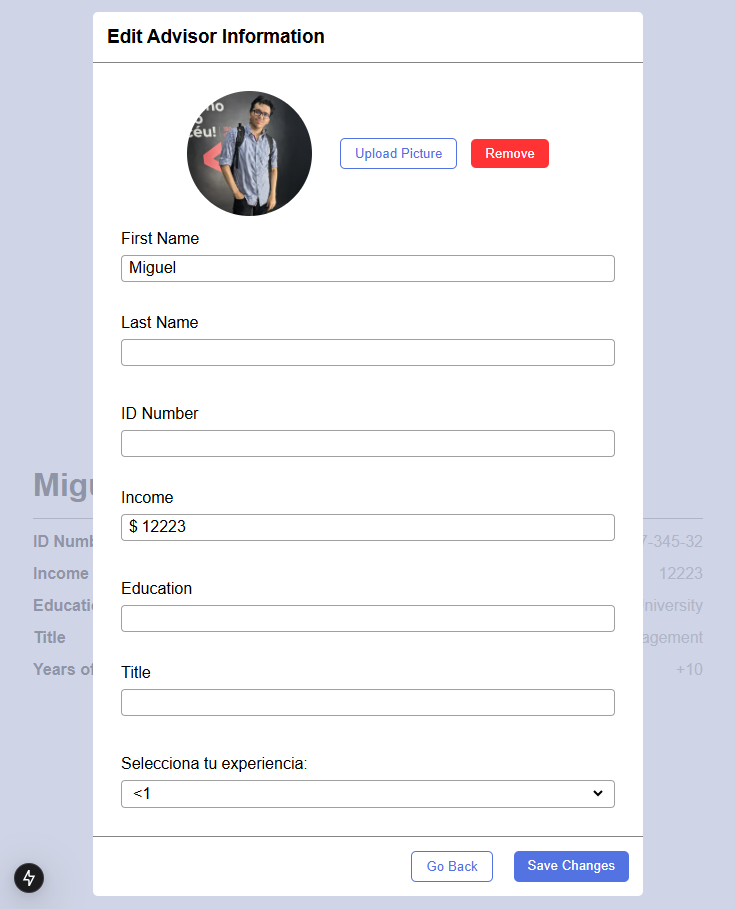
